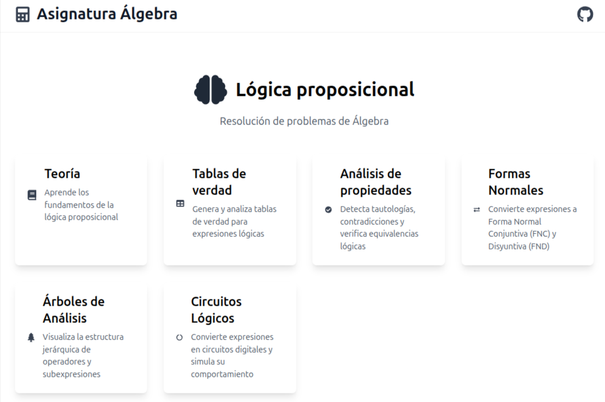
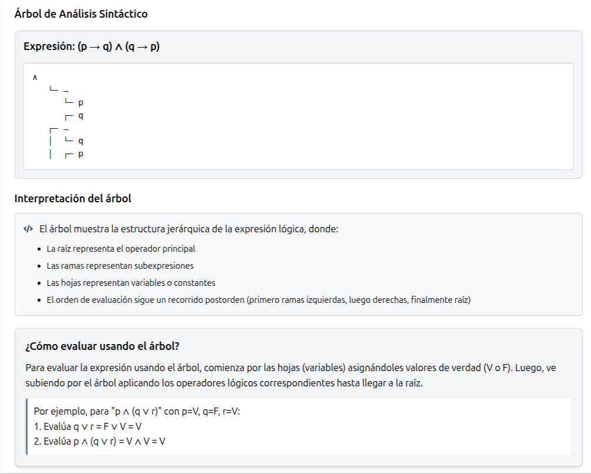
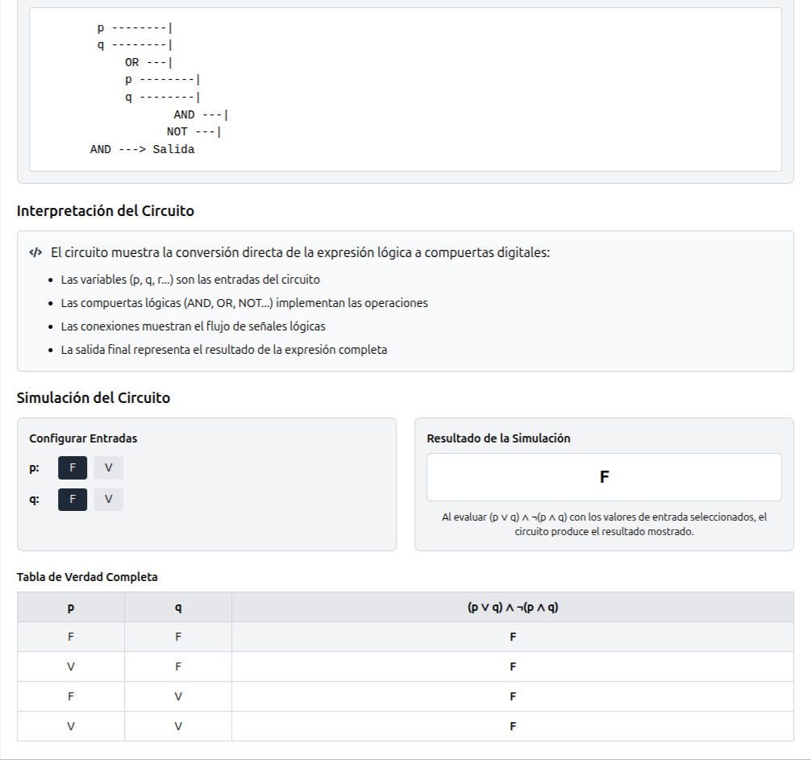

# Asignatura Álgebra - v2

Una aplicación web educativa completa para el aprendizaje de Lógica Proposicional, incluyendo tablas de verdad, formas normales, árboles sintácticos y circuitos lógicos. Perfecta para estudiantes y profesores.



## Novedades en la versión 2 (Mayo 2025)

- **Sección teórica completa con 9 apartados**
  - Fundamentos de lógica proposicional
  - Operadores lógicos
  - Tablas de verdad
  - Equivalencia lógica
  - Propiedades lógicas
  - Formas normales (FNC y FND)
  - Árboles de análisis sintáctico (NUEVO!)
  - Circuitos lógicos (NUEVO!)
  - Ejemplos y ejercicios prácticos interactivos (NUEVO!)
  
  

- **Árboles de Análisis Sintáctico** (Nueva funcionalidad)
  - Visualización de la estructura jerárquica de expresiones
  - Representación gráfica de operadores y subexpresiones
  - Ejemplos predefinidos para facilitar el aprendizaje
  - Explicación del proceso de evaluación a través del árbol
  
  

- **Circuitos Lógicos** (Nueva funcionalidad)
  - Conversión de expresiones a representaciones de circuitos
  - Visualización gráfica de compuertas y conexiones
  - Simulación del comportamiento con diferentes entradas
  - Explicación de la relación entre expresiones y circuitos
  
  

- **Formas Normales** (Nueva funcionalidad)
  - Conversión automática a Forma Normal Conjuntiva (FNC)
  - Conversión automática a Forma Normal Disyuntiva (FND)
  - Explicación paso a paso del proceso de conversión
  - Ejemplos predefinidos para facilitar el aprendizaje
  
  

- **Sistema de navegación mejorado**
  - Índice interactivo para la sección de teoría
  - Enlaces directos entre teoría y herramientas prácticas
  - Acceso rápido a todas las funcionalidades desde la página principal
  - Estructura coherente y fácil de navegar

- **Ejercicios prácticos interactivos**
  - Ejercicios para todas las áreas de la lógica proposicional
  - Pasos detallados para resolver cada ejercicio
  - Enlaces directos a las herramientas correspondientes
  - Ejemplos prácticos para reforzar conceptos teóricos
 


## Características anteriores mejoradas

- **Editor de expresiones lógicas**
  - Interfaz intuitiva para construir expresiones
  - Soporte para 6 variables (p, q, r, x, y, z)
  - Validación en tiempo real de la expresión
  - Operadores lógicos completos (AND, OR, NOT, NAND, NOR, XOR, XNOR, Implicación)

- **Generación de tablas de verdad**
  - Generación automática basada en la expresión
  - Visualización clara y ordenada
  - Evaluación en tiempo real
  - Soporte para expresiones complejas con paréntesis
  
  

- **Evaluador de propiedades lógicas**
  - Detección automática de tautologías, contradicciones y contingencias
  - Análisis de equivalencia entre expresiones
  - Resultados detallados con explicaciones
  
  

- **Exportación de resultados**
  - Exportación a PDF con formato profesional
  - Exportación a TXT para análisis posterior
  - Inclusión de metadatos y fecha de generación

## Tecnologías utilizadas

- React
- Vite
- Tailwind CSS
- TypeScript
- jsPDF (para exportación PDF)

## Instalación

```bash
# Clonar el repositorio
git clone [url-del-repositorio]

# Instalar dependencias
npm install

# Iniciar el servidor de desarrollo
npm run dev
```

## Guía de uso

### 1. Aprendizaje Teórico

- **Explorar la sección de teoría**
   - Accede desde la página principal o la barra de navegación
   - Navega por las 9 secciones teóricas usando el índice interactivo
   - Explora desde fundamentos básicos hasta conceptos avanzados

- **Estudiar ejemplos y ejercicios**
   - Revisa los ejemplos prácticos en la sección 9 de la teoría
   - Utiliza los enlaces directos para acceder a las herramientas relacionadas
   - Prueba resolver los ejercicios propuestos para cada tema

### 2. Tablas de Verdad

- **Crear una expresión lógica**
   - Utiliza el editor de expresiones con sus botones interactivos
   - Selecciona variables, operadores y paréntesis
   - La expresión se valida automáticamente en tiempo real

- **Generar y analizar la tabla**
   - Presiona "Generar tabla de verdad"
   - Visualiza todos los casos posibles y los resultados
   - Identifica patrones y condiciones específicas

- **Exportar resultados**
   - Elige entre formato PDF o TXT
   - Los archivos incluyen la expresión y todos los resultados

### 3. Análisis de Propiedades

- **Verificar propiedades lógicas**
   - Introduce una o dos expresiones para comparar
   - Analiza si son tautologías, contradicciones o contingencias
   - Comprueba si dos expresiones son lógicamente equivalentes
   
- **Interpretar resultados**
   - Revisa las tablas generadas para cada expresión
   - Observa la columna final que muestra la evaluación completa
   - Lee el análisis automático de propiedades

### 4. Formas Normales

- **Convertir expresiones a formas normales**
   - Introduce una expresión lógica
   - Genera su Forma Normal Conjuntiva (FNC)
   - Genera su Forma Normal Disyuntiva (FND)
   
- **Analizar el proceso de conversión**
   - Observa los pasos detallados de la transformación
   - Visualiza la tabla de verdad equivalente
   - Compara las formas resultantes con la expresión original

### 5. Árboles de Análisis Sintáctico

- **Generar árboles sintácticos**
   - Introduce una expresión o selecciona un ejemplo predefinido
   - Visualiza la estructura jerárquica de la expresión
   - Identifica el operador principal y las subexpresiones
   
- **Interpretar los árboles**
   - Observa cómo se organizan los operadores por precedencia
   - Entiende el orden de evaluación de la expresión
   - Utiliza el árbol para seguir el proceso de evaluación paso a paso

### 6. Circuitos Lógicos

- **Diseñar circuitos a partir de expresiones**
   - Introduce una expresión lógica
   - Visualiza su representación como circuito digital
   - Observa la disposición de compuertas lógicas
   
- **Simular comportamiento del circuito**
   - Configura diferentes valores para las entradas
   - Observa cómo se propagan los valores a través del circuito
   - Analiza la tabla de verdad equivalente y su salida final

## Operadores disponibles

| Símbolo | Nombre      | Descripción                                        |
|---------|-------------|---------------------------------------------------|
| ∧       | AND         | Verdadero solo si ambos operandos son verdaderos  |
| ∨       | OR          | Verdadero si al menos un operando es verdadero    |
| ¬       | NOT         | Invierte el valor de verdad                       |
| ⊼       | NAND        | Negación del AND                                  |
| ⊽       | NOR         | Negación del OR                                   |
| ⊕       | XOR         | Verdadero si los operandos son diferentes         |
| ↔       | XNOR        | Verdadero si los operandos son iguales           |
| →       | Implicación | Falso solo si el antecedente es V y consecuente F |

## Contribuir

Las contribuciones son bienvenidas. Por favor, abre un issue primero para discutir los cambios que te gustaría realizar.

## Licencia

MIT License - ver el archivo [LICENSE.md](LICENSE.md) para más detalles.
